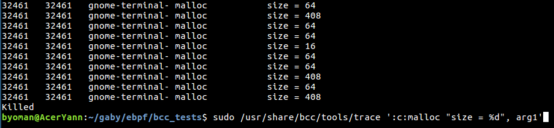
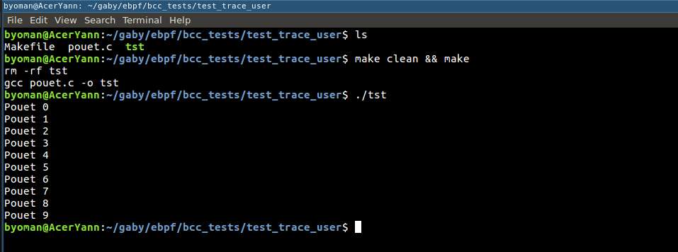
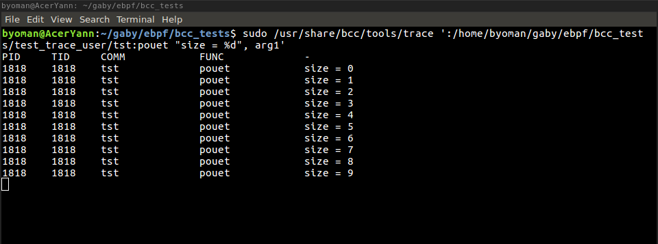

---

History and Context
===================

Since workstations became interconnected, network administrators had a
need to “see” what is flowing on the wires. The ability to sniff the
network traffic is necessary when things go wrong, even for the most
basic debugging.

For this reason operating systems developed APIs for packet sniffing.
But, as there wasn’t any real standard for it every OS had to invent a
different API: Sun’s STREAMS NIT, DEC’s Ultrix Packet Filter, SGI’s
Snoop and Xerox Alto had CMU/Stanford Packet Filter (also called
**CSPF**). This led to many complications.

These APIs just copied all the packets to the user space sniffer (which
on a busy system resulted in a flood of useless work, copying data is
expensive) and then used their filtering algorithms to select the
correct packets (these algorithms were also a bit inefficient, but we’ll
talk about that later).

All this changed in 1993 when Steven McCanne and Van Jacobson published
the paper introducing a better way of filtering packets in the kernel,
BPF.

Introduction to BPF/cBPF
========================

BPF, as in **Berkeley Packet Filter** (initially conceived in 1992)
provide a way to filter packets and to avoid useless packet copies from
kernel to userspace. It initially consisted in a simple bytecode that is
injected from userspace into the kernel, where it is checked by a
verifier—to prevent kernel crashes or security issues—and attached to a
socket, then run on each received packet.

It was ported to Linux a couple of years later, and used for a small
number of applications (tcpdump for example). The simplicity of the
language as well as the existence of an in-kernel Just-In-Time (JIT)
compiling machine for BPF were factors for the excellent performances of
this tool.

Then in 2013, Alexei Starovoitov completely reshaped it, started to add
new functionalities and to improve the performances of BPF. This new
version is designated as eBPF (for “extended BPF”), while the former
becomes cBPF (“classic” BPF).

cBPF packet filtering design
----------------------------

cBPF used a re-designed, register-based ‘filter machine’ that can be
implemented efficiently on today’s register based RISC CPUs (CSPF used a
memory-stack-based filter machine) and used a simple, non-shared buffer
model made possible by today’s larger address spaces. The model is very
efficient for the ‘usual cases’ of packet capture. cBPF had two main
components: the network tap and the packet filter. The network tap
collects copies of packets from the network device drivers and delivers
them to listening applications. The filter decides if a packet should be
accepted and,if so, how much of it to copy to the listening application.

")

Filter design
-------------

A packet filter is simply a boolean valued function on a packet. If the
value of the function is true the kernel copies the packet for the
application; if it is false the packet is ignored.

Historically there have been two approaches to the filter abstraction: a
boolean expression tree (used by CSPF) and a directed acyclic control
flow graph or CFG (used by BPF). In the tree model each node represents
a boolean operation while the leaves represent test predicates on packet
fields. The edges represent operator-operand relationships. In the CFG
model each node represents a packet field predicate while the edges
represent control transfers. The righthand branch is traversed if the
predicate is true, the lefthand branch if false. There are two
terminating leaves which represent true and false for the entire
filter.

For example, the following figures show a CFG filter function that accepts all
packets with an Internet address foo (considering a scenario where the
network layer protocols are IP, ARP, and Reverse ARP),
and the boolean expression tree for the same filter.

")

")

BPF uses the CFG filter model since it has a significant performance
advantage over the expression tree model (which will redundantly parse
the packet many times).

Design of the BPF pseudo-machine
--------------------------------

The BPF pseudo-machine was developped following these constraints:

1.  It must be protocol independent. The kernel should not have to be
    modified to add new protocol support (Packets are viewed as simple
    arrays of bytes).

2.  It must be general. The instruction set should be rich enough to
    handle unforeseen uses.

3.  Packet data references should be minimized (we touch a given packet
    word once).

4.  Decoding an instruction should consist of a single C
    switch statement.

5.  The abstract machine registers should reside in physical registers.

The BPF machine abstraction consists of an accumulator, an index
register (x), a scratch memory store, and an implicit program counter.
The operations on these elements can be categorized into **load**
instructions, **store** instructions, **ALU** instructions, **branch
instructions** and **miscellaneous** instructions.

") 

")

")

Therefore, the CFG respresented earlier can be redrawn
with the appropriate instructions:

")

cBPF limitations
----------------

In essence, cBPF (and eBPF, but we’ll see that later) allows the user to
execute code into kernel context. This may sound risky, but it actually
is’nt. Before executing the BPF bytecode, the kernel statically analyse
it to ensure that it’s safe:

1.  All the jumps are only forward, which guarantees that there aren’t
    any loops in the BPF program. Therefore it must terminate.

2.  All instructions, especially memory reads are valid and
    within range.

3.  The single BPF program has less than 4096 instructions.

C calling convention
--------------------

Okay. But the user needs a API with which he will load his filter into
the kernel. Linux provides a calling (in C), so that the user can write
a program with a cBPF filter, attach it to a socket and do stuff with
the results. Such a program must include **<linux/filter.h>**
which contains the following relevant structures:

    struct sock_filter {	/* Filter block */
    	__u16	code;   /* Actual filter code */
    	__u8	jt;	/* Jump true */
    	__u8	jf;	/* Jump false */
    	__u32	k;      /* Generic multiuse field */
    };

Such a structure is assembled as an array of 4-tuples, that contains
a code, jt, jf and k value. jt and jf are jump offsets and k a generic
value to be used for a provided code.

    struct sock_fprog {			/* Required for SO_ATTACH_FILTER. */
    	unsigned short		   len;	/* Number of filter blocks */
    	struct sock_filter __user *filter;
    };

For socket filtering, a pointer to this structure (as shown in
follow-up example) is being passed to the kernel through setsockopt(2).

Then you simply create your filter code, send it to the kernel via the SO\_ATTACH\_FILTER
option and if your filter code passes the kernel check on it, you then
immediately begin filtering data on that socket.

You can also detach filters from your socket via the SO\_DETACH\_FILTER
option. This is not used much since when you close a socket that has a
filter on it the filter is automatically removed. another less common
case may be adding a different filter on the same socket where you had
another filter that is still running: the kernel takes care of removing
the old one and placing your new one in its place, assuming your filter
has passed the checks, otherwise if it fails the old filter will remain
on that socket. [This code example](https://github.com/byoman/intro-ebpf/blob/master/code/exemple_tcpdump.c) attaches a socket filter for a PF\_PACKET socket in order to let all IPv4/IPv6
packets with port 22 pass. The rest will be dropped for this socket.

Results
-------

Compared to CSPF, cBPF is way more efficient and leaves the user more
CPU for ’legitimate’ requests, as shown in Figure here.

")

Extended BPF
============

The ability to run user-supplied programs inside of the kernel proved to
be a useful design decision but other aspects of the original BPF design
didn’t hold up so well. For one, the design of the virtual machine and
its instruction set architecture (ISA) were left behind as modern
processors moved to 64-bit registers and invented new instructions
required for multiprocessor systems. BPF’s focus on providing a small
number of RISC instructions no longer matched the realities of modern
processors.

So, Alexei Starovoitov introduced the extended BPF (eBPF) design to take
advantage of advances in modern hardware. The eBPF virtual machine more
closely resembles contemporary processors, allowing eBPF instructions to
be mapped more closely to the hardware ISA for improved performance. One
of the most notable changes was a move to 64-bit registers and an
increase in the number of registers from two to ten. Since modern
architectures have far more than two registers, this allows parameters
to be passed to functions in eBPF virtual machine registers, just like
on native hardware.

The JIT machines were rewritten. The new language is even closer to
native machine language than cBPF was. And also, new attach points in
the kernel have been created. Optimizations on these just-in-time
instructions compilation made eBPF four times faster on x86-64 than the
old classic BPF (cBPF) implementation for some network filter
microbenchmarks, and most were 1.5 times faster.

Originally, eBPF was only used internally by the kernel and cBPF
programs were translated seamlessly under the hood. But with in 2014,
eBPF has been made available for direct use from user space.

What can we do with eBPF?
-------------------------

You can still filter network packets like cBPF, but you can do so much
more! Basically, the goal is to load your program into the kernel and to
attach it to any designated code path, and once this code pah is
traversed, any attached eBPF program is executed. Therefore, eBPF is
useful for:

1.  Kprobes (tracing kernel functions);

2.  Uprobes (tracing user functions);

3.  Linux Tracepoints;

4.  USDT (Userland Statically Defined Tracing).

How can we do it?
-----------------

When the patch set setting up ebpf was added to the kernel, a new
syscall named **bpf()** was added too. It is a multiplexor for a range
of different operations. A wrapper library was also supplied to present
those operations as a set of independent functions (the actual
operations are done with the bpf() system call though). The prototye for
the syscall is:

    int bpf(int cmd, union bpf_attr *attr, unsigned int size);

The *bpf\_attr* union allows data to be passed between the kernel and
user space; the exact format depends on the *cmd* argument. The *size*
argument gives the size of the *bpf\_attr* union object in bytes.\
The *cmd* is a macro describing a command (all the macros are described
in the *&lt;linux/bpf.h&gt;*), here are the most commonly used:

1.  BPF\_PROG\_LOAD,

2.  BPF\_MAP\_CREATE,

3.  BPF\_MAP\_LOOKUP\_ELEM,

4.  BPF\_MAP\_UPDATE\_ELEM,

5.  BPF\_MAP\_DELETE\_ELEM

In my following explanations I’ll only use the name of the command, to
avoid to redundantly say that it works with the bpf() syscall.

To see all the details about eBPF prog types, map types or any other
information, see the bpf() man page.

### Loading a program

A program is loaded into the kernel using the BPF\_PROG\_LOAD command,
or using the wrapper function:
'''
    int bpf_load_program(enum bpf_prog_type type, struct bpf_insn *insns,
    		     size_t insns_cnt, char *license,
    		     u32 kern_version, char *log_buf,
    		     size_t log_buf_sz);
'''
The *prog\_type* argument specifies the program type to which we will
attach the filter. It dictates four things: where the program can be
attached, which in-kernel helper functions the verifier will allow to be
called, whether network packet data can be accessed directly, and the
type of object passed as the first argument to the program. In fact, the
program type essentially defines an API.

The BPF\_PROG\_TYPE\_KPROBE, BPF\_PROG\_TYPE\_TRACEPOINT and
BPF\_PROG\_TYPE\_PERF\_EVENT are useful for tracing.\

### eBPF data structure (how do we store and access the collected data?)

eBPF tracing calculates the stats in kernel domain itself. Therefore we
need some memory/data structure within the kernel to create such stats.
eBPF Maps are a generic data structure for storage of different types of
data in the form of key-value pair. They allow sharing of data between
eBPF kernel programs, and also between kernel and user-space
applications. They are created via the BPF\_MAP\_CREATE command, which
return a new file descriptor referring to the map. Each map has the
following attribute:

1.  map type;

2.  maximum number of elements;

3.  key size in bytes;

4.  value size in bytes

There are different types of maps (e.g., hash, array, program array,
etc.), that are chosen based on the use or need. For example, if the key
is a string (or not from an integer series), then a hash map can be used
for faster lookup; however, if the key is like an index, then an array
map will provide the fastest lookup method.

To access the data collected into the map(s) we created, we use the
BPF\_MAP\_LOOKUP\_ELEM command, which look up an element with a given
key in the file referred by the file descriptor of the map. We can also
use the commands BPF\_MAP\_UPDATE\_ELEM, BPF\_MAP\_DELETE\_ELEM, and
BPF\_MAP\_GET\_NEXT\_KEY to manipulate maps.

Building eBPF bytecode
----------------------

From a user perspective, eBPF bytecode can be another headache to
generate. Fortunately, the LLVM Clang compiler has grown support for an
eBPF backend that compiles C into bytecode. Object files containing this
bytecode can then be directly loaded with the bpf() system call and
BPF\_PROG\_LOAD command.

You can write your own eBPF program in C by compiling with Clang using
the *-march=bpf* parameter. There are plenty of eBPF program examples in
the kernel’s *samples/bpf/* directory; the majority have a “\_kern.c”
suffix in their file name. The object file (eBPF bytecode) emitted by
Clang needs to be loaded by a program that runs natively on your machine
(these samples usually have “\_user.c” in their filename). To make it
easier to write eBPF programs, the kernel provides the libbpf library,
which includes helper functions for loading programs and creating and
manipulating eBPF objects.

For example, the high-level flow of an eBPF program and user program
using libbpf might go something like:

1.  Read the eBPF bytecode into a buffer in your user application and
    pass it to bpf\_load\_program().

2.  The eBPF program, when run by the kernel, will
    call bpf\_map\_lookup\_elem() to find an element in a map and store
    a new value in it.

3.  The user application calls bpf\_map\_lookup\_elem() to read out the
    value stored by the eBPF program in the kernel.

However, all of the sample code suffers from one major drawback: you
need to compile your eBPF program from within the kernel source tree.
Luckily, the BCC project was created to solve this problem. It includes
a complete toolchain for writing eBPF programs and loading them without
linking against the kernel source tree.

eBPF limitations
----------------

Unlike cBPF, eBPF allows backwards jump in the bytecode, and thus for
one main reason: when running and building eBPF bytecode, the compiler
will emit backwards jumps (a result of the compiler’s optimization).
Thus linux developpers needed to allow these backwards jumps, and they
had to modify the verifier to assure the user does not attempt to make
loops (an infinite loop would cause your kernel to lock up), though the
linux devs are working on a way to allow bounded loops into eBPF.

The single BPF program is still limited to 4096 instructions, and all
instructions must be valid and within range.

eBPF safety (Verifier)
----------------------

There are inherent security and stability risks with allowing user-space
code to run inside the kernel. So, a number of checks are performed on
every eBPF program before it is loaded.

The first test ensures that the eBPF program terminates and does not
contain any loops that could cause the kernel to lock up. This is
checked by doing a depth-first search of the program’s control flow
graph (CFG). Unreachable instructions are strictly prohibited; any
program that contains unreachable instructions or containing more than
4096 instructions will fail to load.

The second stage is more involved and requires the verifier to simulate
the execution of the eBPF program one instruction at a time. The virtual
machine state is checked before and after the execution of every
instruction to ensure that register and stack state are valid. Out of
bounds jumps are prohibited, as is accessing out-of-range data. Since
it’s analyzing all paths through the program, the length of the analysis
is limited to 64k instructions (which may be hit even if total number of
instructions is less then 4096, but there are too many branches that
change stack/registers). The number of ’branches to be analyzed’ is
limited to 1024.

The verifier also has a “secure mode” that prohibits pointer arithmetic.
Secure mode is enabled whenever a user without the CAP\_SYS\_ADMIN
privilege loads an eBPF program. The idea is to make sure that kernel
addresses do not leak to unprivileged users and that pointers cannot be
written to memory. If secure mode is not enabled, then pointer
arithmetic is allowed but only after additional checks are performed.
For example, all pointer accesses are checked for type, alignment, and
bounds violations.

Registers with uninitialized contents (those that have never been
written to) cannot be read; doing so cause the program load to fail. The
contents of registers R0-R5 are marked as unreadable across functions
calls by storing a special value to catch any reads of an uninitialized
register. Similar checks are done for reading variables on the stack and
to make sure that no instructions write to the read-only frame-pointer
register.

Lastly, the verifier uses the eBPF program type to restrict which kernel
functions can be called from eBPF programs and which data structures can
be accessed. Some program types are allowed to directly access network
packet data, for example.

BCC, eBPF for human beings
--------------------------

IOVisor’s BCC (BPF Compiler Collection) is a toolkit for creating
efficient kernel tracing and manipulation programs using eBPF. Including
several useful tools and examples, it makes BPF programs easier to
write, with kernel instrumentation in C (and includes a C wrapper around
LLVM), and front-ends in Python and lua. It is suited for many tasks,
including performance analysis and network traffic control, and well
documented.

")

The only constraint is that your kernel must have been built with a set
of options activated (the list is available on the BBC’s github
repository).

Userland Tracing
----------------

Using BCC, it is quite easy to write an Uprobe tracing a libc’s function
or an user defined function. The **trace** tool, provided when
installing BCC, can do both. The libc is the default place where trace
will look up for the wanted symbol.

The following Figure shows the results of the *trace* tracing each call
to *malloc* along with the size allocated:

For a user-defined function you have to specify a path to the .so
library or the executable. Here is a test with
a dummy function I defined (prototype **pouet(int i)**), and the *trace*
tool tracing each of its calls and storing its parameter.

As for writing custom probes, [this code example implements](https://github.com/byoman/intro-ebpf/blob/master/code/trace_user_func.py) a command-line tool to trace any user
function (given its name and a correct path if needed, much like trace
but far less powerful), and stores the first argument and the number of
times the function is called with this argument.

eBPF among other tracing tools
==============================

Although eBPF has many qualities and is described as a “Linux
superpower” or as “revolutionary”, it is not the only Linux tracing
technology.

Below is an non-exhaustive list of tracing technologies and tools:

1.  ftrace;

2.  SystemTap;

3.  Sysdig;

4.  the *perf\_event\_open* system call;

As this document focus on eBPF, I will not dwell on all these other
technologies. However, Julia Evans wrote a good
[article](https://jvns.ca/blog/2017/07/05/linux-tracing-systems/)
introducing those technologies and their use.

")

Conclusion
==========

To respond to the questions asked in the preface of this document:

1.  BPF works by loading user code inside the Linux kernel in a safe
    manner, and to attach this code to various tracepoints or events;

2.  Initially developed for network filtering, it became that much
    extensible by extending it from networks sockets to all tracepoints
    and events in the Linux kernel, by extending its instruction set and
    architecture, and by consolidating the code checking done when the
    user tries to load his code to make sure it does not harm or leaks
    out of reach data from the kernel in any way;

3.  We can do userland tracing by writing custom eBPF programs and
    attach them to the functions and/or event we want to trace or by
    using front-end APIs and specific purpose tools based on eBPF.

Appendix
========

cBPF code example
-----------------

[This](https://github.com/byoman/intro-ebpf/blob/master/code/exemple_tcpdump.c) code example attaches a socket filter for a PF\_PACKET socket in order to let all IPv4/IPv6 packets with port 22 pass. The rest will be dropped for this socket.

eBPF - BCC uprobe example
-------------------------

[This](https://github.com/byoman/intro-ebpf/blob/master/code/trace_user_func.py) command-line tool trace a userland function and store its first argument. The user musts provide the function’s name, and its path if it is a user defined function. It was implemented using BCC’s Python API.
